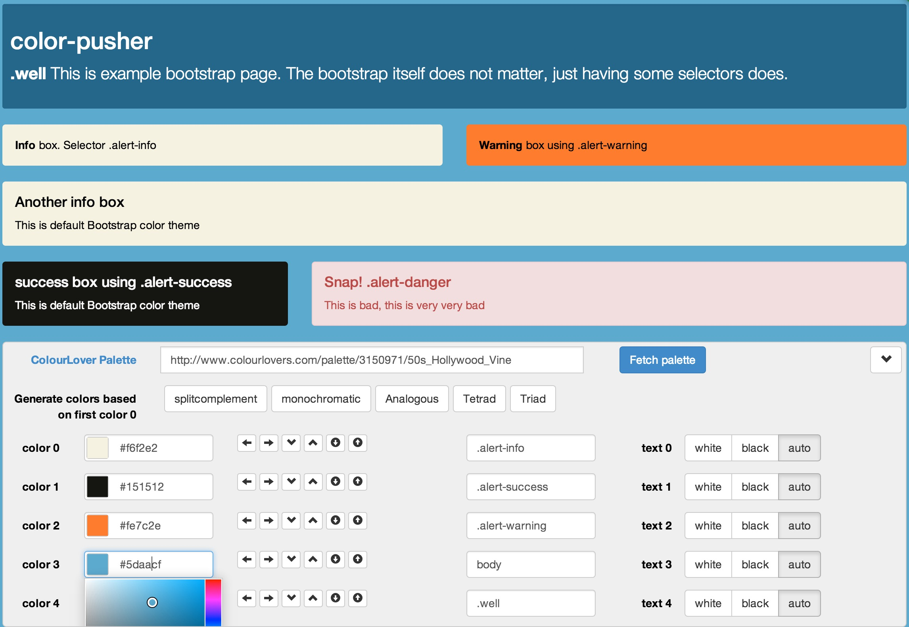

# color-pusher v0.1.5

> Dynamic color swatch manipulation for changing multiple elements CSS

[demo](http://glebbahmutov.com/color-pusher/)

[![NPM][color-pusher-icon] ][color-pusher-url]

[![Build status][color-pusher-ci-image] ][color-pusher-ci-url]
[![dependencies][color-pusher-dependencies-image] ][color-pusher-dependencies-url]
[![devdependencies][color-pusher-devdependencies-image] ][color-pusher-devdependencies-url]

[![endorse][endorse-image] ][endorse-url]

[color-pusher-icon]: https://nodei.co/npm/color-pusher.png?downloads=true
[color-pusher-url]: https://npmjs.org/package/color-pusher
[color-pusher-ci-image]: https://travis-ci.org/bahmutov/color-pusher.png?branch=master
[color-pusher-ci-url]: https://travis-ci.org/bahmutov/color-pusher
[color-pusher-dependencies-image]: https://david-dm.org/bahmutov/color-pusher.png
[color-pusher-dependencies-url]: https://david-dm.org/bahmutov/color-pusher
[color-pusher-devdependencies-image]: https://david-dm.org/bahmutov/color-pusher/dev-status.png
[color-pusher-devdependencies-url]: https://david-dm.org/bahmutov/color-pusher#info=devDependencies
[endorse-image]: https://api.coderwall.com/bahmutov/endorsecount.png
[endorse-url]: https://coderwall.com/bahmutov




The color-pusher widget allows anyone to quickly tweak colors on the page,
including by theme / similarity / complementary.
Now you can give the website to the graphic designer and let them
explore and push colors.

### installation

Requires [nodejs](http://nodejs.org/) and [bower](http://bower.io/)

```sh
bower install color-pusher
```

To use: requires bootstrap CSS and JS, jquery and angularjs.


### use

include css and js in document's head

```html
<link rel="stylesheet" href="bower_components/color-pusher/dist/color-pusher.css">
<script src="bower_components/color-pusher/dist/color-pusher.js"></script>
```

or include minified css and js

```html
<link rel="stylesheet" href="bower_components/color-pusher/dist/color-pusher.min.css">
<script src="bower_components/color-pusher/dist/color-pusher.min.js"></script>
```

#### Simple

> include widget as stand alone Angular module at the end of the body for example

```html
<div ng-app="color-pusher">
    <color-pusher></color-pusher>
</div>
```

If you already have an Angular application, add *color-pusher* as a dependency

```js
var app = angular.module('my-app', ['color-pusher']);
```

#### Intermediate

> pass initial list of selectors and colors to the widget

```html
<color-pusher
    selectors="body, .well, .info"
    colors="#f5e384, #9c846e, #9c046e">
</color-pusher>
```

Open the widget and click "Apply colors".


## Related

Read this great short [tutorial](http://www.rocket-design.fr/color-template/)
on picking the right color template for your website for background information.

Uses [jQuery xcolor](http://www.xarg.org/project/jquery-color-plugin-xcolor/)
and [pusher.color.js](http://tech.pusherhq.com/libraries/color) plugins
to manipulate colors.
Uses [jquery-minicolors](http://labs.abeautifulsite.net/jquery-minicolors/) color picker
via [angular-minicolors](http://kaihenzler.github.io/angular-minicolors/).

### Small print

Author: Gleb Bahmutov Copyright &copy; 2013

* [@bahmutov](https://twitter.com/bahmutov)
* [glebbahmutov.com](http://glebbahmutov.com)
* [blog](http://bahmutov.calepin.co/)

License: MIT - do anything with the code, but don't blame me if it does not work.

Spread the word: tweet, star on github, etc.

Support: if you find any problems with this module, email / tweet / open issue on Github


## History


0.1.5 / 2013-12-09
==================

  * hiding colour lovers fields using attribute, fixes #41
  * moved show/hide logic to outer widget, fixes #40

0.1.4 / 2013-12-08
==================

  * split colourslovers, widget and color-pusher (outer widget)
  * printing palette fetch error to console
  * using aged, fixes #38

0.1.3 / 2013-12-07
==================

  * Merge branch 'feature/split-apply'
  * started splitting widget from main controller

0.1.2 / 2013-12-05
==================

  * added badges
  * added travis file, fixes #34

0.1.1 / 2013-12-04
==================

  * minified js and css
  * added banner to output files, fixes #21
  * adding empty spacer to prevent widget from overlaying on top of the content

0.1.0 / 2013-12-02
==================

  * allowing swapping selectors, fixes #19
  * easy colors export, fixes #31

0.0.9 / 2013-12-01
==================

  * addition of new colors, fixes #4
  * added ability to remove selected color
  * when fetching palette, button is disabled, fixes #23

0.0.8 / 2013-12-01
==================

  * selectors and colors can be passed as attributes, fixes #27
  * attaching color-pusher widget to bottom of the window
  * added favicon, fixes #26

0.0.7 / 2013-12-01
==================

  * selected better default colors
  * changed button layout

0.0.6 / 2013-12-01
==================

  * added glyphs, hide and show widget
  * added alertify, fixes #12, fixes #16

0.0.5 / 2013-12-01
==================

  * created nicer angular directive
  * removed bootstrap js min
  * compiling into widget
  * setting border color same as background

0.0.4 / 2013-11-30
==================

  * switched default text color strategy to auto
  * fetching colourlover palette using API, fixes #5
  * you can set strategy for generating text color, fixes #9
  * colors and selectors adjust dynamically to generated colors

0.0.3 / 2013-11-29
==================

  * you can set strategy for generating text color, fixes #9
  * colors and selectors adjust dynamically to generated colors
  * added different color generation strategies

0.0.2 / 2013-11-28
==================

  * every color allows color picker or edit

0.0.1 / 2013-11-28
==================

  * added grunt gh-pages task
  * added small color samples to input fields
  * recomputing everything on changed based color, and applying colors

0.0.0 / 2013-11-27
==================

  * added grunt tasks
  * initial


